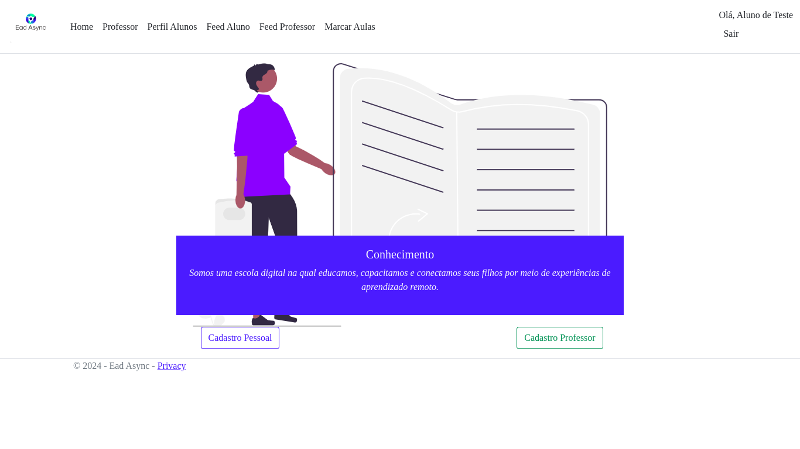
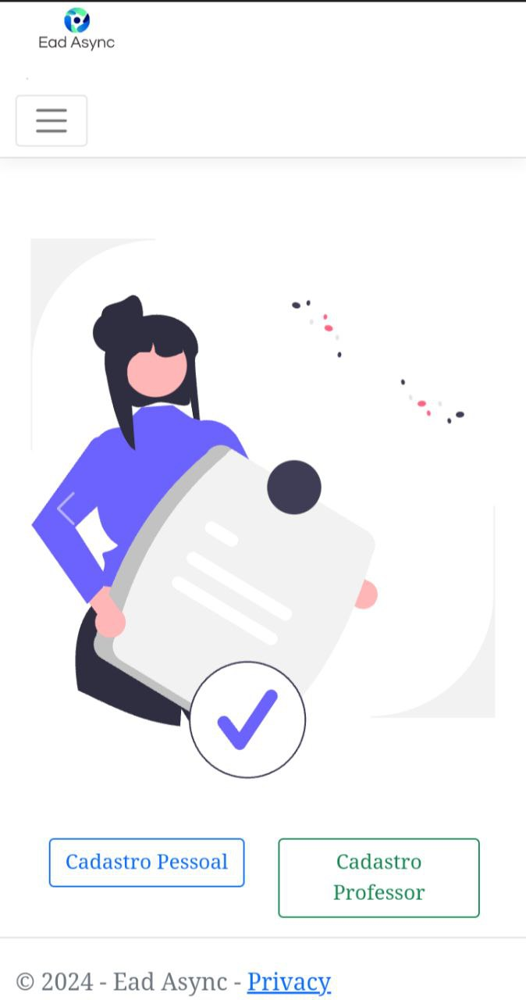

# Template Padrão da Aplicação

Pré-requisitos: <a href="2-Especificação do Projeto.md"> Especificação do Projeto</a>, <a href="3-Projeto de Interface.md"> Projeto de Interface</a>, <a href="4-Metodologia.md"> Metodologia</a>

Layout padrão da aplicação que será utilizado em todas as páginas com a definição de identidade visual, aspectos de responsividade e iconografia.

# As paletas de cores utilizadas na aplicação são. 
| cores | codigo   |
| ---   | ---      |
| branco| `#F8F9FA`|
| azul  | `#0D6EFD`|
| verde | `#198754`|
| preto | `#000000`|
| cinza | `#6C757D`|

---

## tipografia
`Helvetica`, `sans-serif`.

---

## logo
Cores da logo `#ccff33`, `#809fff`, `#002699`,`#6C757D`.

---

## Layout do site versão desktop.

---

## Layout do site versão mobile.

---

> **Links Úteis**:
>
> - [CSS Website Layout (W3Schools)](https://www.w3schools.com/css/css_website_layout.asp)
> - [Website Page Layouts](http://www.cellbiol.com/bioinformatics_web_development/chapter-3-your-first-web-page-learning-html-and-css/website-page-layouts/)
> - [Perfect Liquid Layout](https://matthewjamestaylor.com/perfect-liquid-layouts)
> - [How and Why Icons Improve Your Web Design](https://usabilla.com/blog/how-and-why-icons-improve-you-web-design/)
