# Programação de Funcionalidades

O padrão de criação da aplicação utilizado foi o MVC, que consiste na divisão em camadas de funcionamento (Model,View,Controller). Foi utilizado
o ASP.NET MVC para a concepção da aplicação, baseada principalmente na realização de CRUDs , com o acrécimo do Entity framework para o mapeamento relacional dos objetos. 

# Modelos base 

Utilizando o princípio da POO, foi criado modelos de classe base para o funcionamento da aplicação. A utilização do Entity Framework facilitou
a criação das tabelas e colunas no Banco de Dados

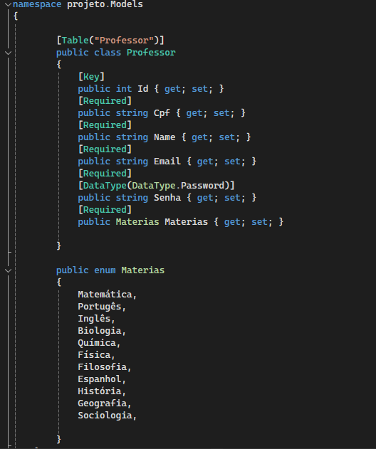

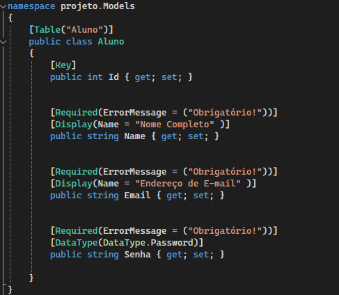

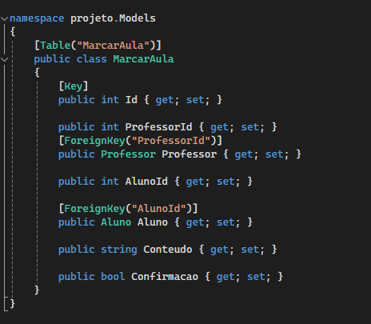

# Criação de usuários Professor/Aluno

Para realizar o cadastro de cada entidade, foi criado um controlador para cada, com a função Create, para realizar o cadastro,
e a função Edit, para realizar a troca de senhas em caso de perda. Foi utilizado o pacote BCrypt na aplicação para realizar o
hash nas senhas, garantindo maior segurança para a aplicação.

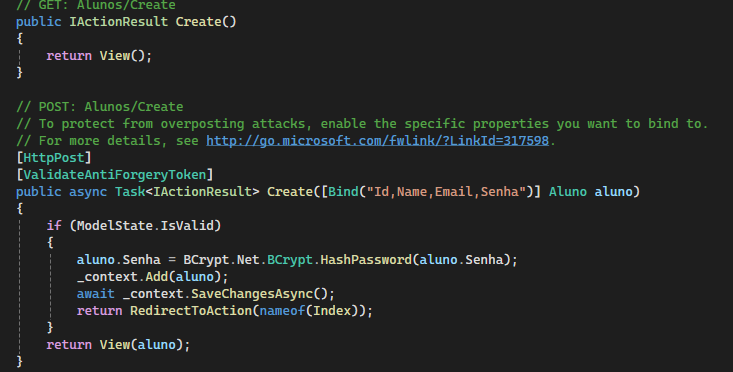

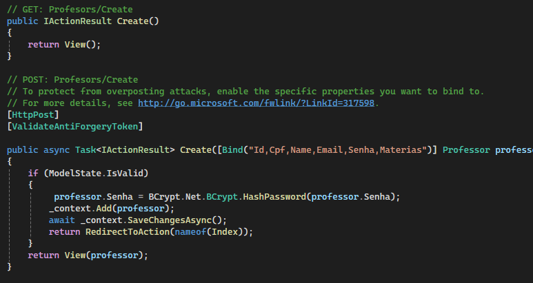

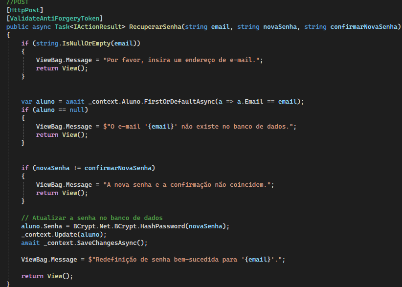

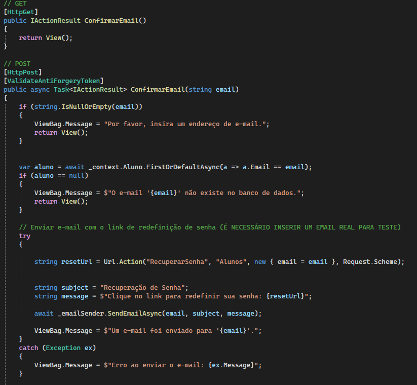

# Funcionalidade Marcar Aula

Para realizar o objetivo proposto pela aplicação, de alunos marcarem aulas particulares com professores, foi necessário criar
um controlador para esse propósito. Temos a funcionalidade de buscar por uma matéria em específica, realizar a marcação da aula com o professor por
parte do aluno.

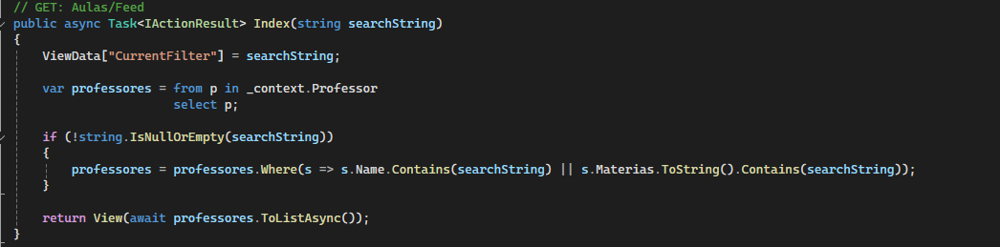

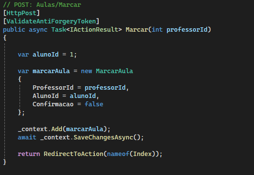

# Login e autentificação

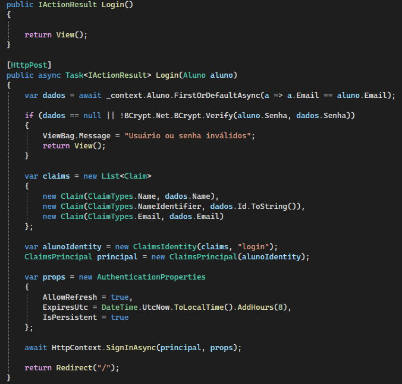

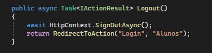