# Programação de Funcionalidades

# Lucas Chagas de Oliveira - Tela de Cadastro.

Visando aprender sobre Asp.Net, uso o segundo exemplo do Professor Kleber para ter uma base fundamental para criar a minha tela de cadastro. Com isso foquei na criação de banco de dados de usuarios, veiculos e consumo.

A base do código é definida principalmente por duas tabelas, veiculos e consumo:

-  ### A PRIMEIRA FEITA É A TABELA DE VEÍCULOS, ONDE A TABELA CONSEGUE MAPEAR ALGUNS DADOS DE VEÍCULO PREENCHIDOS PELO USUÁRIO FINAL.
   

-  ### A SEGUNDA FEITA É A DE CONSUMOS, ONDE O USUÁRIO CONSEGUE REGISTRAR O CONSUMO DO CARRO.

   

   

-  ### TERCEIRA FEITA É A DE CADASTRO DE USUÁRIOS, ONDE O USUÁRIO CONSEGUE CADASTRAR SEU PERFIL E O BANCO DE DADOS SALVA AS INFORMAÇÕES E CRIPTOGRAFA.
   

# Nickolas Ribeiro de Mendonça - Feed do Aluno.

A página de feed tem a função de mostrar ao usuário cartões que incluem detalhes sobre os professores e as matérias que eles oferecem na plataforma. Além disso, exibe o custo por aula e uma descrição breve feita pelo professor, que ajuda o aluno na escolha de sua monitoria. Para disponibilizar essas informações ao usuário após ele entrar na plataforma, foi preciso desenvolver algumas tabelas:

-  Usuarios
-  Disciplinas
-  ProfessorDisciplina
-  AlunoProfessoresDisciplinas

-  ### Imagens aos models utilizados para poder definir as tabelas do banco.

-  #### Usuários

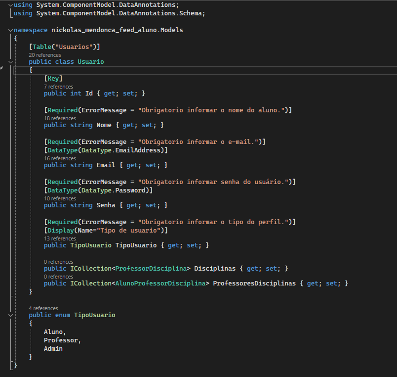

-  #### Disciplinas

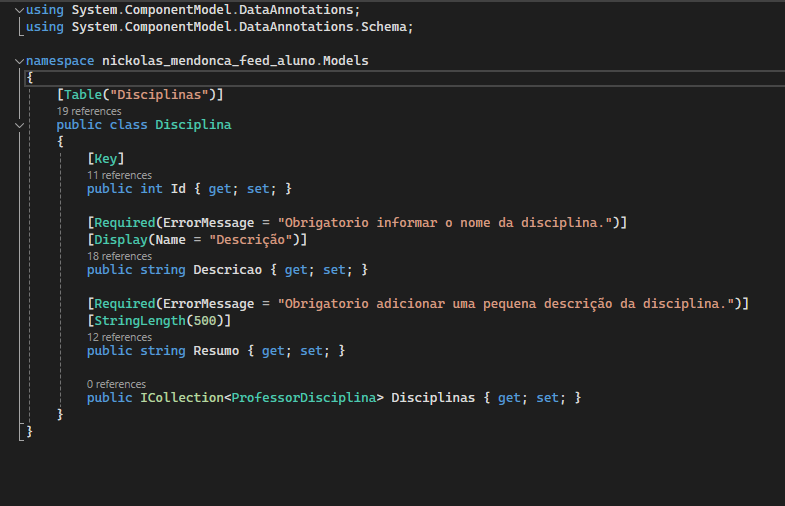

-  #### ProfessorDisciplinas

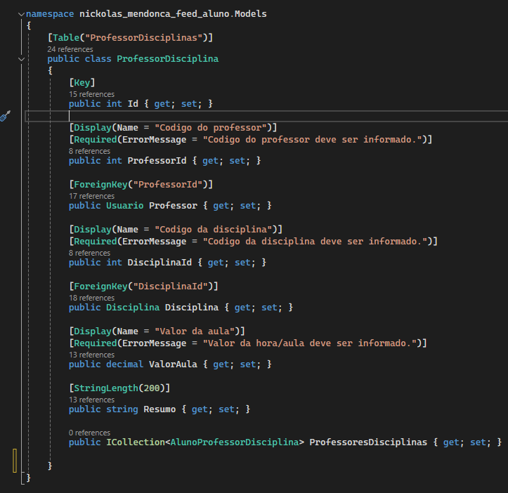

-  #### AlunoProfessoresDisciplinas

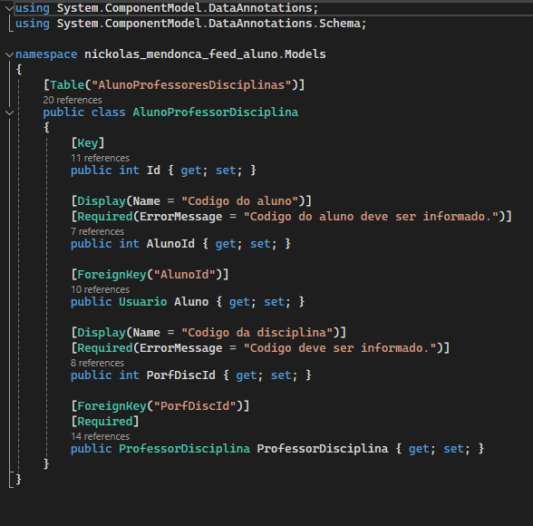

-  ### Após a definição dos modelos de dados, procedeu-se à criação das migrações correspondentes, que foram posteriormente executadas para efetivar a criação das tabelas no banco de dados. Com a estruturação das tabelas completada, em seguida, desenvolveram-se os controladores (controllers) e as visualizações (views). Esse processo marca um ponto crucial, pois é nesse estágio que se torna viável a manipulação de dados por meio de interfaces. Seguem imagens das interfaces geradas

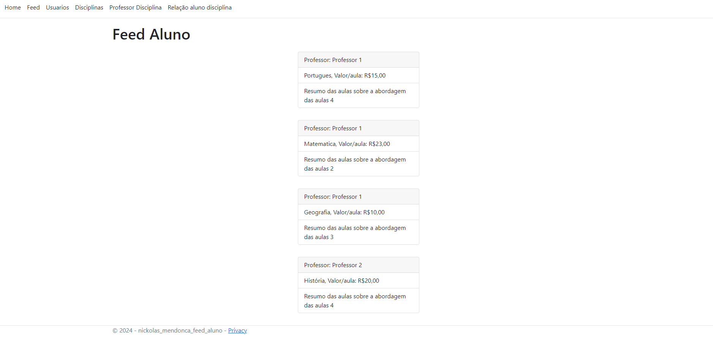
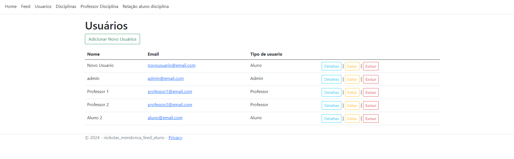
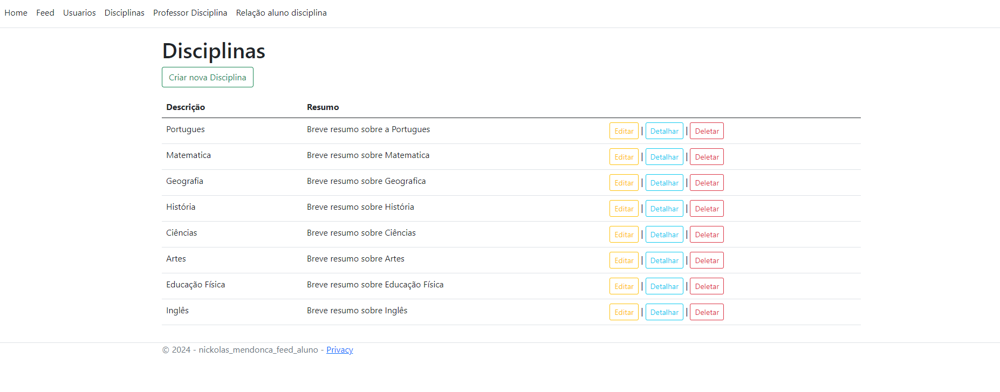
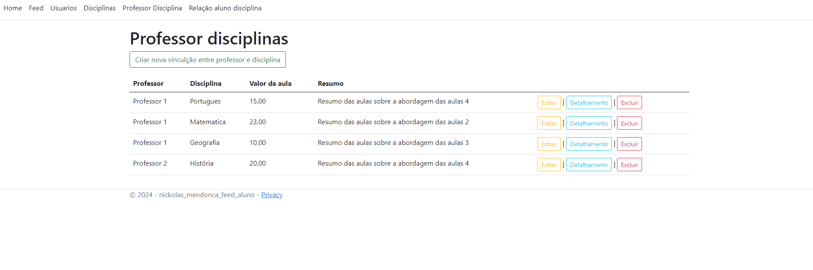
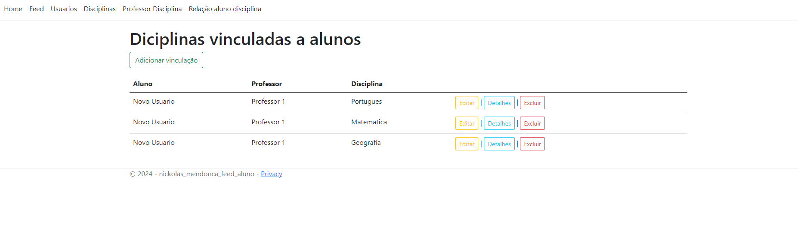
---

# Mailson Da Silva Costa - PERFIL ALUNO
Estudando sobre Asp.Net, eu usei o exemplo do Professor Kleber para ter uma base fundamental para criar a minha tela do Perfil do aluno. Tiver muitos erros pois meu sistema é linux.

O exemplo do Professor Kleber foi tentado reproduzi no meu sistema, que é um linux. Eu tentei fazer de tudo para sair perfeitamente, porém deu error, então recorri à documentação oficial da microsoft e desenvolvi um crude CREATA, UPDATE, DELETE de uma aplicação de filmes.

## Ferramentas usadas
| OS  | IDL |
| --- | --- |
| Ubuntu 22.04.4 LTS | VISUAL STUDIO CODE |

| num | ferramenta|versão testada|
| --- |    ---    |---      |
| 1   | dotnet    |V8.0.103|
| 2   | dotnet ef |6.0.10   |
| 3   | nuget.exe |6.9.1.3  |
| 4   | mono      |6.8.0.105|

---

### extensões usadas

| num  | extensão |
| --- | --- |
| 1 | .NET Install Tool |
| 2 | C# |
| 3 | C# Dev Kit |
| 4 | C# Extensions |
| 5 | NuGet Gallery |
---

### pacotes usados
| num | pacote                                         |versão testada|
| ---|              ---                                |--- |
| 1  |Microsoft.EntityFrameworkCore.Design             |V8.0.4|
| 2  |Microsoft.EntityFrameworkCore.SQLite             |V8.0.4|
| 3  |Microsoft.VisualStudio.Web.CodeGeneration.Design |V8.0.4|
| 4  |Microsoft.EntityFrameworkCore.SqlServer          |V8.0.4| 
| 5  |Microsoft.EntityFrameworkCore.Tools             |V8.0.4| 
    
---

 # captura de tela do app feito
 ## Abaixo segue as capturas de tela da aplicação web crude, CREATE, UPDATE, DELETE.

### Pagina gerada com o comando `aspnet-codegenerator`
---

### Fazendo a Migração com `dotnet ef migrations`

---

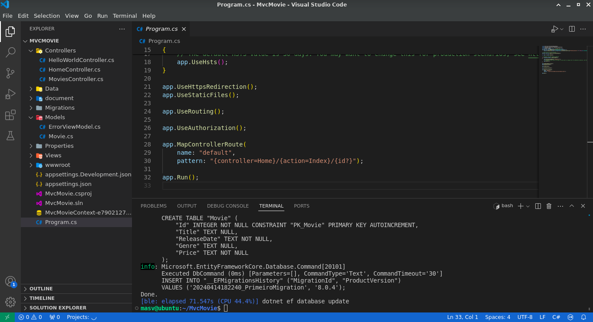

### Atualizando  o banco de dados `dotnet ef database update`

---

### Dados inserido no banco de dados sqlite
---

### CRUDE DA APLICAÇÃO `CREATE`, `UPDATE`, `DELETE`
---

APLICAÇÂO COM BANCO DE DADOS

---

# Lizandra Ruiz Cavalcante dos Santos - Feed Professor
Aprendendo sobre Asp.Net, usei os exemplos do Professor Kleber para ter uma base fundamental para criar a minha tela de Feed de Professor. Com isso foquei na criação de banco de dados de professores para poder testar no minha tela sobre o professor, onde os alunos vao saber um pouco sobre ele e ver sobre oque ele ensina.

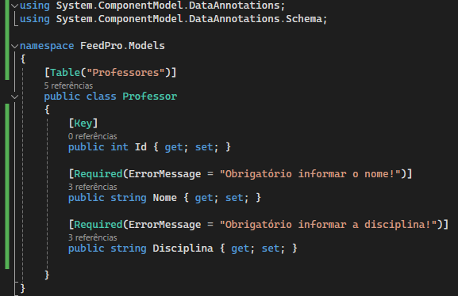
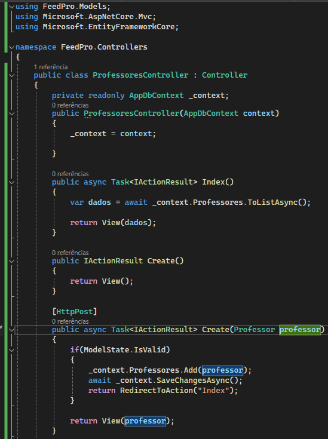
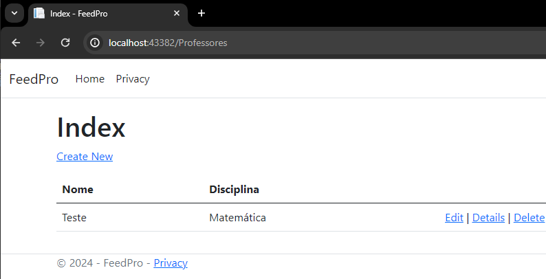

# Marco Antonio de Oliveira C. Júnior - HOME (página inicial)

---

O QUE FOI REALIZADO ATÉ O MOMENTO:
- A tela home foi realizada.
- Exemplos foram reproduzidos.
- Uma aplicação variante do exemplo dos microfundamentos foi criada.
- Foi associada à tela de login uma funcionalidade de registro/login utilizando o modelo de autenticação "Individual Accounts" junto ao IdentityDbContext.

COMO FOI ESTUDADO:
- Através dos exemplos do microfundamento, mas principalmente por meio de exemplos encontrados em videoaulas diversas e na própria documentação do ASP.NET.

PROBLEMAS ENCONTRADOS:
- Foram encontrados diversos problemas durante a implementação, desde não conseguir enviar dados ao Banco de Dados até problemas em instanciar as classes do Entity Framework.

---

| Prints referentes aos exemplos do microfundamento |
| ------------------------------------------------- |

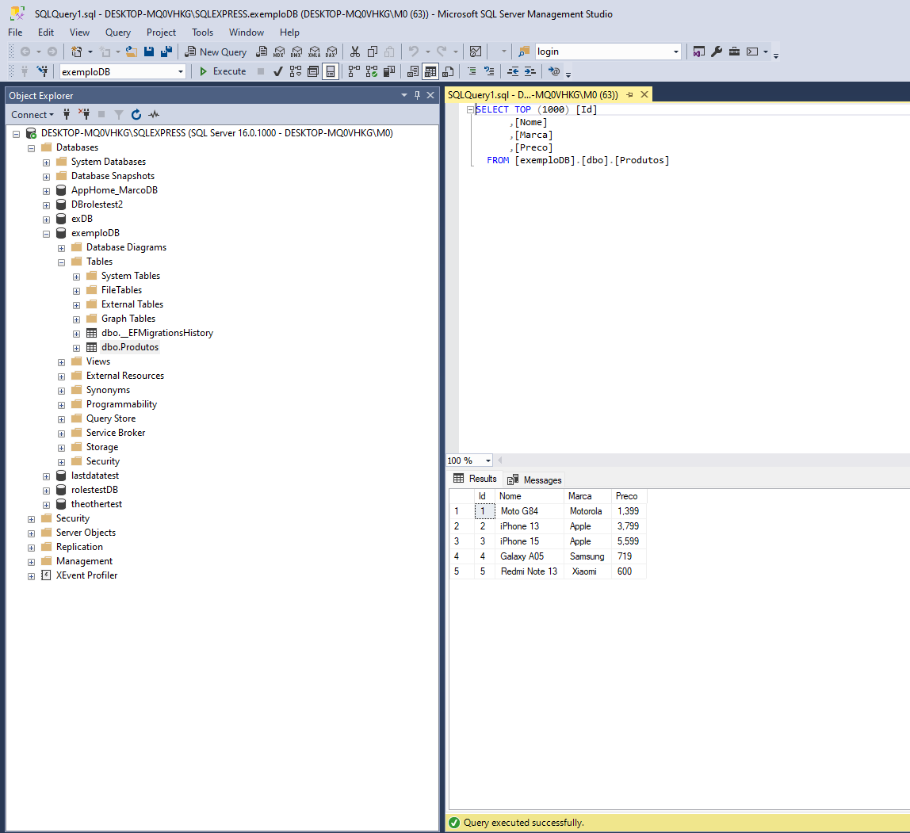
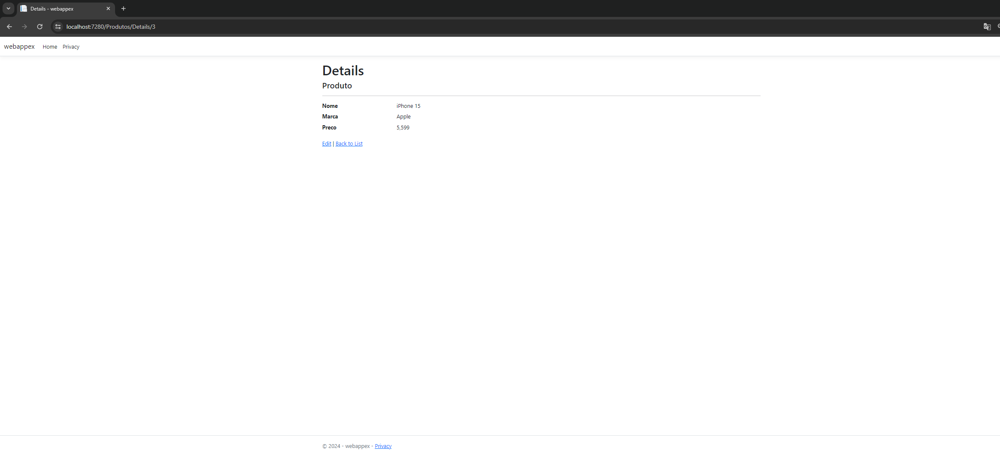
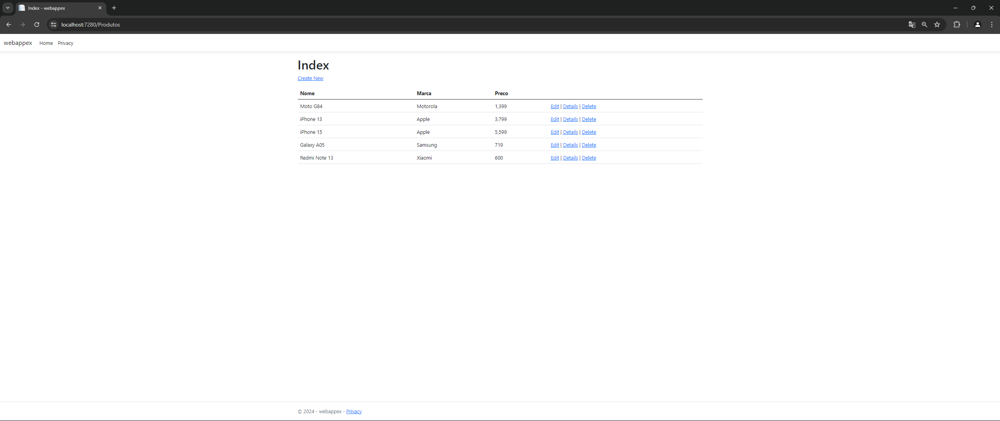

| Prints referentes a tela Home |
| ----------------------------- |

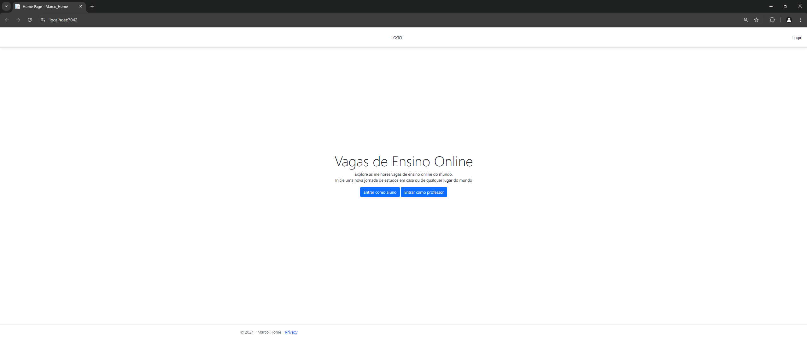

| Prints referentes a outras funcionalidades desenvolvidas |
| -------------------------------------------------------- |

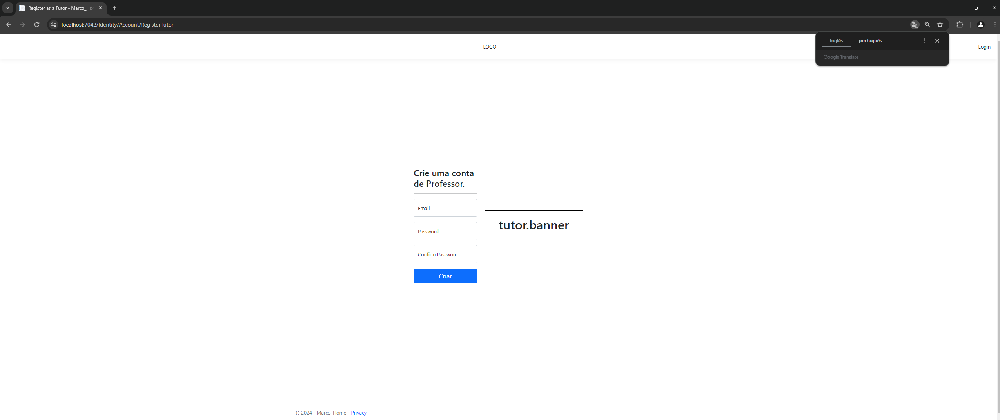
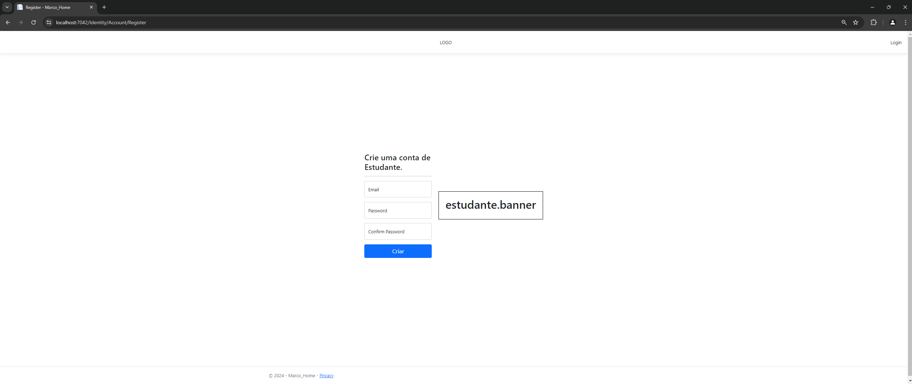
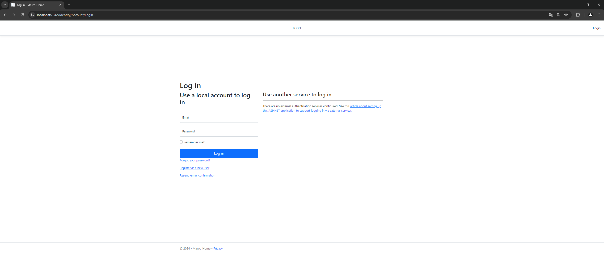
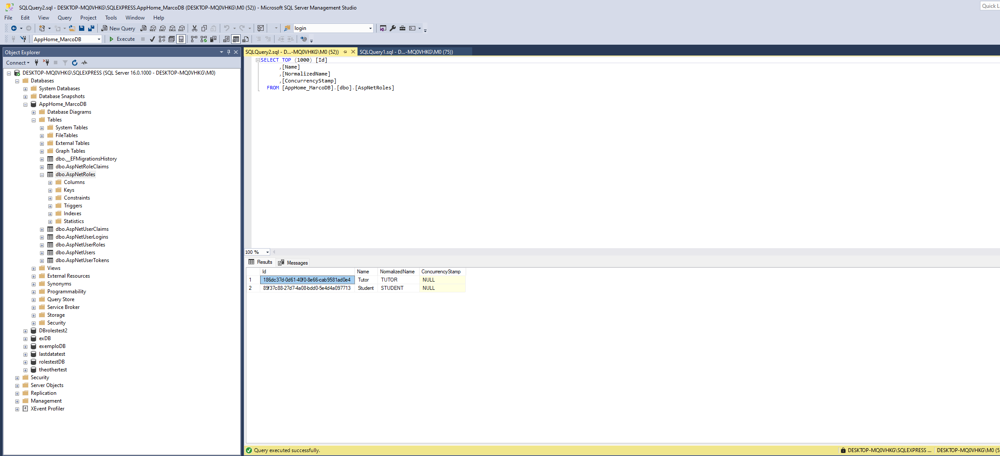
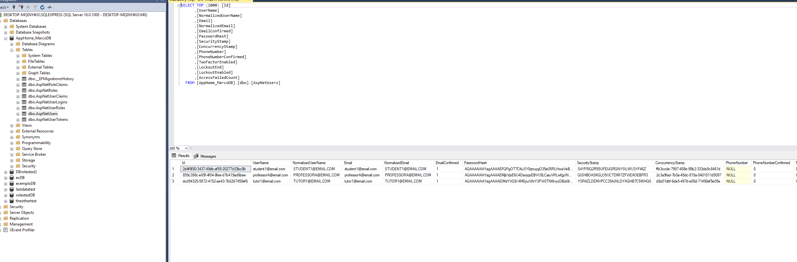
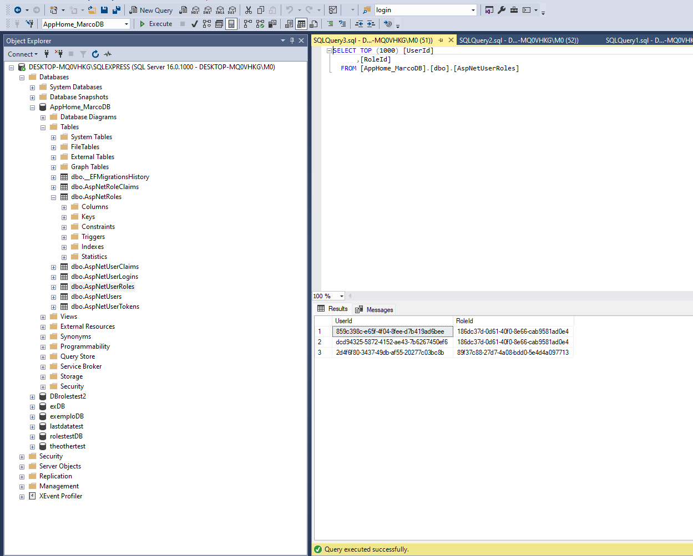
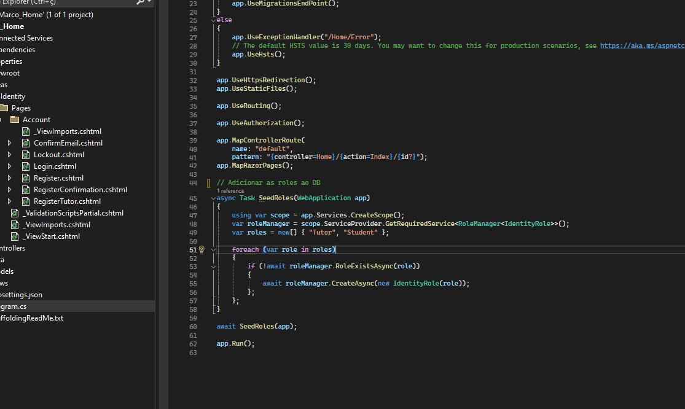
