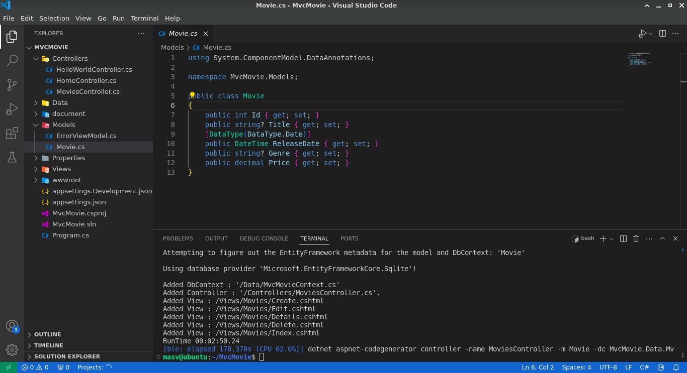
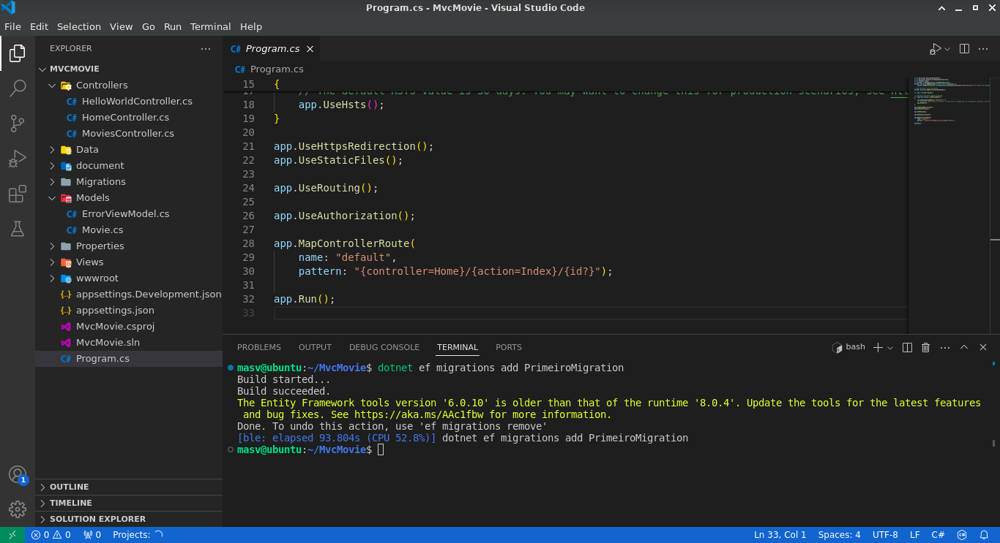
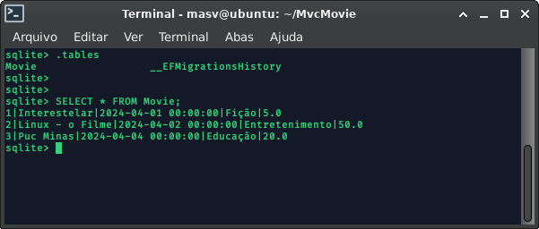
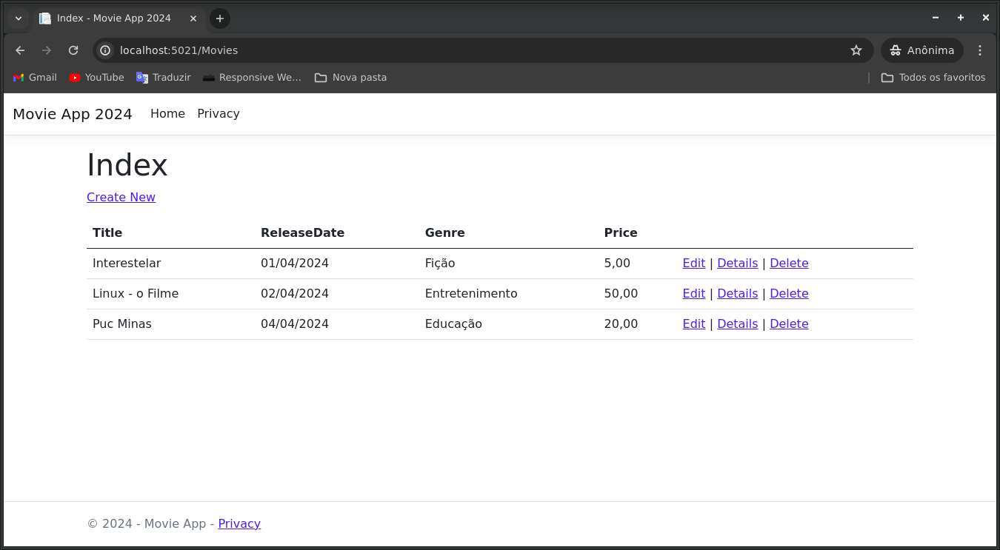

# Mailson 
---
Visando aprender sobre Asp.Net, eu usei o  exemplo do Professor Kleber para ter uma base fundamental para criar a minha tela do Perfil do aluno. 
---

O exemplo do Professor Kleber foi tentado reproduzi no meu sistema, que é um linux. Eu tentei fazer de tudo para sair perfeitamente, porém deu error, então recorri à documentação oficial da microsoft e desenvolvi um crude CREATA, UPDATE, DELETE de uma aplicação de filmes.

## Ferramentas usadas
| OS  | IDL |
| --- | --- |
| Ubuntu 22.04.4 LTS | VISUAL STUDIO CODE |

| num | ferramenta|versão testada|
| --- |    ---    |---      |
| 1   | dotnet    |V8.0.103|
| 2   | dotnet ef |6.0.10   |
| 3   | nuget.exe |6.9.1.3  |
| 4   | mono      |6.8.0.105|

---

### extensões usadas

| num  | extensão |
| --- | --- |
| 1 | .NET Install Tool |
| 2 | C# |
| 3 | C# Dev Kit |
| 4 | C# Extensions |
| 5 | NuGet Gallery |
---

### pacotes usados
| num | pacote                                         |versão testada|
| ---|              ---                                |--- |
| 1  |Microsoft.EntityFrameworkCore.Design             |V8.0.4|
| 2  |Microsoft.EntityFrameworkCore.SQLite             |V8.0.4|
| 3  |Microsoft.VisualStudio.Web.CodeGeneration.Design |V8.0.4|
| 4  |Microsoft.EntityFrameworkCore.SqlServer          |V8.0.4| 
| 5  |Microsoft.EntityFrameworkCore.Tools             |V8.0.4| 
    
---

 
 # captura de tela do app feito
 ## Abaixo segue as capturas de tela da aplicação web crude, CREATE, UPDATE, DELETE.

### Gerar pagina com `aspnet-codegenerator`
---

### Migração `dotnet ef migrations`

---

### Atualiza o banco de dados `dotnet ef database update`

---

### Dados inserido no banco de dados sqlite
---

### CRUDE DA APLICAÇÃO `CREATE`, `UPDATE`, `DELETE`
---

